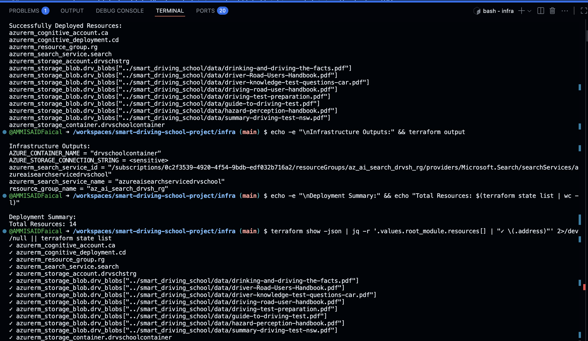

# Smart Driving School Project

This project provides an AI-powered platform for driving school exam preparation, leveraging Azure Cognitive Search, Azure OpenAI, and LangChain agents.

## Getting Started

### 1. Clone the Repository

```sh
git clone https://github.com/AMMISAIDFaical/smart-driving-school-project.git
cd smart-driving-school-project
```

### 2. Open in VS Code Dev Container

Open the folder in VS Code and **reopen in the dev container** when prompted.  
The dev container runs on Ubuntu 20.04.6 LTS and includes the Azure CLI (with Azure development extension) and all needed dependencies pre-installed and available on the `PATH`.

### 3. Create a Conda Environment

```sh
conda create -n smartdriving python=3.12
conda activate smartdriving
pip install -r requirements.txt
```

### 4. Update Terraform Provider

Go to the `infra` folder and update the provider block in `main.tf`:

````terraform
provider "azurerm" {
  features {}

  subscription_id = "az-sub-id"
}
````
Replace "az-sub-id" with your actual Azure subscription ID.

### 5. Initialize and Apply Terraform
Provision all Azure resources:

````cd infra
terraform init
terraform apply
````

Once apply is complete verifie on the portal that all resources are created and get the needed paramaters for .env file population



### 6. Working with the `context` Folder

The `smart_driving_school/src/context/` folder contains scripts for managing Azure Cognitive Search indexes and indexers.

### Key Scripts

- `creating_index.py`  
  Script holds two functions that help in creating index and upload driving lessons pdf files stored in `smart_driving_school/src/data/` to provisioned blob storage. These are helper functions for the `creating_indexer.py` script.

- `creating_indexer.py`  
  Script creates and runs an Azure AI Search indexer with AI enrichment and key phrase extraction for data source documents.

### How to Use

1. **Set up your environment variables**  
   Ensure your `.env` file is populated with the correct Azure resource values.

3. **Run the indexer creation script**

   ```sh
   python3 smart_driving_school/src/context/creating_indexer.py
   ```
### 7. Test Azure AI Search Integration
1. Go to azure_ai_search file and Run the sample search script to verify your Azure Cognitive Search setup:

   ```sh
   python smart_driving_school/src/azure_ai_search.py
   ```

   This script will perform a search for the term "alcohol" and display results from your indexed documents.

2. **Customize Search Queries**

   Edit `smart_driving_school/src/azure_ai_search.py` to change the search query or adjust search parameters as needed.

### 8. Running the Driving School Assistant

1. **Verify the Model Configuration**

   Open `smart_driving_school/src/model.py` and review the model settings to ensure they match your requirements and environment.

2. **Start the Console Application**

   Run the main method in `graph.py` to launch the interactive driving school assistant:

   ```sh
   python smart_driving_school/src/graph.py
   ```

   This will start a console application where you can interact with the driving school agents and test
